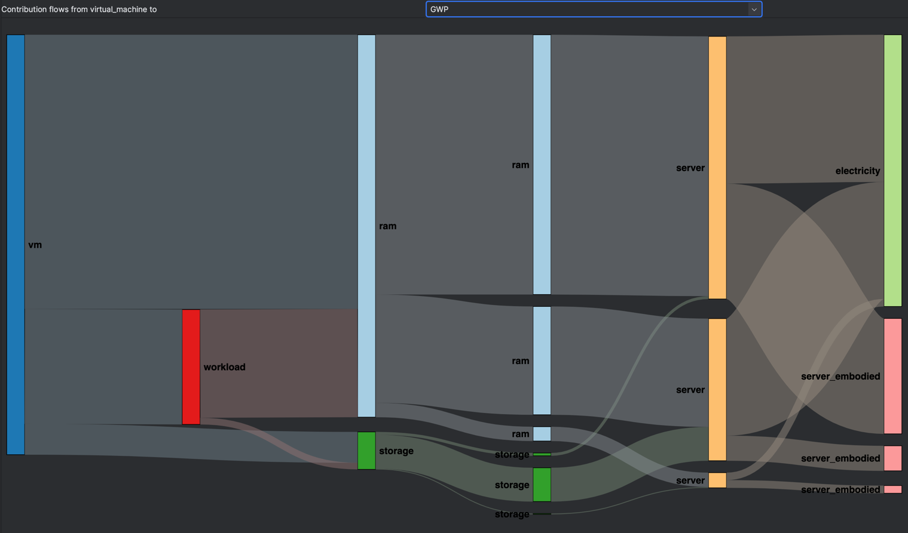

# Cloud Assess


This is the official repository of [Cloud Assess](https://cloudassess.org).

## What is Cloud Assess?

Cloud Assess is an open-source tool to automate the assessment of
the environmental impacts of cloud services.


## Table of Contents

1. [Getting Started](#getting-started)
2. [First Assessment](#first-assessment)
3. [How does it work?](#how-does-it-work)
    * [Trusted Library](#trusted-library)
    * [Adapt the models to your taste](#adapt-the-models-to-your-taste)
4. [License](#license)
5. [About us](#about-us)

## Getting Started

First, you need to clone this repository:

```bash
git checkout git@github.com:kleis-technology/cloud-assess.git
cd cloud-assess
```

All the commands in the sections below are to be run from the root of this repository.
We assume that you will run these commands in bash.
If you are using another shell, please adapt the commands accordingly.

### Docker-compose

You can run the server using `docker-compose`.

```bash
docker compose up -d
```

The API specification is available in the folder `openapi`.
For a more interactive visualisation of the API, the `docker-compose`
also spins up a swagger ui instance.
Visit this [page](http://localhost) to explore the endpoints, DTOs and run example queries.

### Local build and run

#### Requirements

To build the server, you will need

* Java 17 (temurin) environment
* A [GitHub personal access token (classic)](https://docs.github.com/en/authentication/keeping-your-account-and-data-secure/managing-your-personal-access-tokens#creating-a-personal-access-token-classic) with the permission `read:packages` to download packages from GitHub Package Registry.

Then, set up the following environment variables.

```bash
export GITHUB_ACTOR=<your GitHub username>
export GITHUB_TOKEN=<the token you just created>
```

#### Procedure

From the root of the git repository, run

```bash
./gradlew build
```

To run the server locally

```bash
./gradlew bootRun
```

The server should start listening for requests on `localhost:8080`.

Note that, if you are on Windows, use the command `./gradlew.bat` instead of `./gradlew`.

## First Assessment

Each functional unit is associated with a specific API endpoint.
For instance, say we want to assess the environmental impact of using a virtual machine.
The request takes the following form:

```json
{
   "period": {
      "amount": 1.0,
      "unit": "hour"
   },
   "virtual_machines": [
      {
         "id": "vm-01",
         "pool_id": "client_vm",
         "quantity": {
            "amount": 1.0,
            "unit": "u"
         },
         "ram": {
            "amount": 4.0,
            "unit": "GB"
         },
         "storage": {
            "amount": 20.0,
            "unit": "GB"
         },
         "vcpu": {
            "amount": 1.0,
            "unit": "vCPU"
         },
         "meta": {
            "region": "sofia",
            "env": "production"
         }
      }
   ]
}
```

In this request, we specify the usage of our virtual machine in terms
of the quantity of resources used (ram, storage and vCPU).

Running this request yields an impact assessment with the common LCA indicators.
Of course, in this example, we ran the assessment for a single virtual machine,
but nothing stops you from assessing as many virtual machines as you want.
<details>
<summary>
    Expand to see what the result looks like.
</summary>

```json
{
   "virtual_machines": [
      {
         "period": {
            "amount": 1.0,
            "unit": "hour"
         },
         "request": {
            "id": "vm-01",
            "pool_id": "client_vm",
            "quantity": {
               "amount": 1.0,
               "unit": "u"
            },
            "ram": {
               "amount": 4.0,
               "unit": "GB"
            },
            "storage": {
               "amount": 20.0,
               "unit": "GB"
            },
            "vcpu": {
               "amount": 1.0,
               "unit": "vCPU"
            },
            "meta": {
               "region": "sofia",
               "env": "production"
            }
         },
         "impacts": {
            "ADPe": {
               "total": {
                  "amount": 1.1854678736318172E-5,
                  "unit": "kg Sb-Eq"
               },
               "per_lc_step": {
                  "manufacturing": {
                     "amount": 2.225849560067201E-6,
                     "unit": "kg Sb-Eq"
                  },
                  "transport": {
                     "amount": 1.526861504175665E-6,
                     "unit": "kg Sb-Eq"
                  },
                  "use": {
                     "amount": 6.570462152963352E-6,
                     "unit": "kg Sb-Eq"
                  },
                  "end_of_life": {
                     "amount": 1.5315055191119535E-6,
                     "unit": "kg Sb-Eq"
                  }
               }
            },
            "ADPf": {
               "total": {
                  "amount": 62.33162368565782,
                  "unit": "MJ, net calorific value"
               },
               "per_lc_step": {
                  "manufacturing": {
                     "amount": 16.68493611195954,
                     "unit": "MJ, net calorific value"
                  },
                  "transport": {
                     "amount": 16.575951835849164,
                     "unit": "MJ, net calorific value"
                  },
                  "use": {
                     "amount": 12.48864307614414,
                     "unit": "MJ, net calorific value"
                  },
                  "end_of_life": {
                     "amount": 16.582092661704973,
                     "unit": "MJ, net calorific value"
                  }
               }
            },
            "AP": {
               "total": {
                  "amount": 0.027696043162935963,
                  "unit": "mol H+-Eq"
               },
               "per_lc_step": {
                  "manufacturing": {
                     "amount": 0.007594263925867406,
                     "unit": "mol H+-Eq"
                  },
                  "transport": {
                     "amount": 0.007499887185410032,
                     "unit": "mol H+-Eq"
                  },
                  "use": {
                     "amount": 0.005096811622739166,
                     "unit": "mol H+-Eq"
                  },
                  "end_of_life": {
                     "amount": 0.007505080428919357,
                     "unit": "mol H+-Eq"
                  }
               }
            },
            "GWP": {
               "total": {
                  "amount": 4.917652556684529,
                  "unit": "kg CO2-Eq"
               },
               "per_lc_step": {
                  "manufacturing": {
                     "amount": 1.2685097680580173,
                     "unit": "kg CO2-Eq"
                  },
                  "transport": {
                     "amount": 1.2582340374175287,
                     "unit": "kg CO2-Eq"
                  },
                  "use": {
                     "amount": 1.1324125903631403,
                     "unit": "kg CO2-Eq"
                  },
                  "end_of_life": {
                     "amount": 1.2584961608458427,
                     "unit": "kg CO2-Eq"
                  }
               }
            },
            "LU": {
               "total": {
                  "amount": 2.624571812069938,
                  "unit": "u"
               },
               "per_lc_step": {
                  "manufacturing": {
                     "amount": 0.04726920471902647,
                     "unit": "u"
                  },
                  "transport": {
                     "amount": 0.021918300384408593,
                     "unit": "u"
                  },
                  "use": {
                     "amount": 2.5317431295884796,
                     "unit": "u"
                  },
                  "end_of_life": {
                     "amount": 0.02364117737802341,
                     "unit": "u"
                  }
               }
            },
            "ODP": {
               "total": {
                  "amount": 0.013312891435337558,
                  "unit": "kg CFC-11-Eq"
               },
               "per_lc_step": {
                  "manufacturing": {
                     "amount": 0.0044376267209147125,
                     "unit": "kg CFC-11-Eq"
                  },
                  "transport": {
                     "amount": 0.0044376261366686634,
                     "unit": "kg CFC-11-Eq"
                  },
                  "use": {
                     "amount": 1.2410867486489788E-8,
                     "unit": "kg CFC-11-Eq"
                  },
                  "end_of_life": {
                     "amount": 0.004437626166886695,
                     "unit": "kg CFC-11-Eq"
                  }
               }
            },
            "PM": {
               "total": {
                  "amount": 1.443563140628956E-6,
                  "unit": "disease incidence"
               },
               "per_lc_step": {
                  "manufacturing": {
                     "amount": 4.659322817923548E-7,
                     "unit": "disease incidence"
                  },
                  "transport": {
                     "amount": 4.6532709663581914E-7,
                     "unit": "disease incidence"
                  },
                  "use": {
                     "amount": 4.6936584062332816E-8,
                     "unit": "disease incidence"
                  },
                  "end_of_life": {
                     "amount": 4.653671781384491E-7,
                     "unit": "disease incidence"
                  }
               }
            },
            "POCP": {
               "total": {
                  "amount": 0.002505739886538823,
                  "unit": "kg NMVOC-Eq"
               },
               "per_lc_step": {
                  "manufacturing": {
                     "amount": 4.015940673344095E-5,
                     "unit": "kg NMVOC-Eq"
                  },
                  "transport": {
                     "amount": 1.6654121903901202E-6,
                     "unit": "kg NMVOC-Eq"
                  },
                  "use": {
                     "amount": 0.0024609082726224306,
                     "unit": "kg NMVOC-Eq"
                  },
                  "end_of_life": {
                     "amount": 3.0067949925616415E-6,
                     "unit": "kg NMVOC-Eq"
                  }
               }
            },
            "WU": {
               "total": {
                  "amount": 0.2503283010915833,
                  "unit": "m3 world eq. deprived"
               },
               "per_lc_step": {
                  "manufacturing": {
                     "amount": 0.012371380794322486,
                     "unit": "m3 world eq. deprived"
                  },
                  "transport": {
                     "amount": 0.0028470792627199957,
                     "unit": "m3 world eq. deprived"
                  },
                  "use": {
                     "amount": 0.23226350876206023,
                     "unit": "m3 world eq. deprived"
                  },
                  "end_of_life": {
                     "amount": 0.002846332272480629,
                     "unit": "m3 world eq. deprived"
                  }
               }
            },
            "CTUe": {
               "total": {
                  "amount": 58.90191574298565,
                  "unit": "CTUe"
               },
               "per_lc_step": {
                  "manufacturing": {
                     "amount": 18.73533240114092,
                     "unit": "CTUe"
                  },
                  "transport": {
                     "amount": 18.51641380532083,
                     "unit": "CTUe"
                  },
                  "use": {
                     "amount": 3.064604371185056,
                     "unit": "CTUe"
                  },
                  "end_of_life": {
                     "amount": 18.58556516533884,
                     "unit": "CTUe"
                  }
               }
            },
            "CTUh_c": {
               "total": {
                  "amount": 1.9213914310898006E-9,
                  "unit": "CTUh"
               },
               "per_lc_step": {
                  "manufacturing": {
                     "amount": 1.8094839178619905E-10,
                     "unit": "CTUh"
                  },
                  "transport": {
                     "amount": 1.3431110837644963E-10,
                     "unit": "CTUh"
                  },
                  "use": {
                     "amount": 1.4671232876712334E-9,
                     "unit": "CTUh"
                  },
                  "end_of_life": {
                     "amount": 1.3900864325591864E-10,
                     "unit": "CTUh"
                  }
               }
            },
            "CTUh_nc": {
               "total": {
                  "amount": 3.503286449092768E-8,
                  "unit": "CTUh"
               },
               "per_lc_step": {
                  "manufacturing": {
                     "amount": 8.23316171853553E-9,
                     "unit": "CTUh"
                  },
                  "transport": {
                     "amount": 7.746208995686664E-9,
                     "unit": "CTUh"
                  },
                  "use": {
                     "amount": 1.1281201653961916E-8,
                     "unit": "CTUh"
                  },
                  "end_of_life": {
                     "amount": 7.772292122743571E-9,
                     "unit": "CTUh"
                  }
               }
            },
            "Epf": {
               "total": {
                  "amount": 3.763748948066863E-4,
                  "unit": "kg P-Eq"
               },
               "per_lc_step": {
                  "manufacturing": {
                     "amount": 6.67944179626921E-6,
                     "unit": "kg P-Eq"
                  },
                  "transport": {
                     "amount": 3.4798870544897944E-6,
                     "unit": "kg P-Eq"
                  },
                  "use": {
                     "amount": 3.624785519394673E-4,
                     "unit": "kg P-Eq"
                  },
                  "end_of_life": {
                     "amount": 3.737014016459945E-6,
                     "unit": "kg P-Eq"
                  }
               }
            },
            "Epm": {
               "total": {
                  "amount": 0.004107094825533502,
                  "unit": "kg N-Eq"
               },
               "per_lc_step": {
                  "manufacturing": {
                     "amount": 9.038519487735136E-4,
                     "unit": "kg N-Eq"
                  },
                  "transport": {
                     "amount": 8.924280436794234E-4,
                     "unit": "kg N-Eq"
                  },
                  "use": {
                     "amount": 0.0014164017889792132,
                     "unit": "kg N-Eq"
                  },
                  "end_of_life": {
                     "amount": 8.944130441013518E-4,
                     "unit": "kg N-Eq"
                  }
               }
            },
            "Ept": {
               "total": {
                  "amount": 0.04057960045019888,
                  "unit": "mol N-Eq"
               },
               "per_lc_step": {
                  "manufacturing": {
                     "amount": 0.00950936272870918,
                     "unit": "mol N-Eq"
                  },
                  "transport": {
                     "amount": 0.009385327891433154,
                     "unit": "mol N-Eq"
                  },
                  "use": {
                     "amount": 0.01229587775308712,
                     "unit": "mol N-Eq"
                  },
                  "end_of_life": {
                     "amount": 0.009389032076969424,
                     "unit": "mol N-Eq"
                  }
               }
            },
            "IR": {
               "total": {
                  "amount": 0.19346701518814927,
                  "unit": "kBq U235-Eq"
               },
               "per_lc_step": {
                  "manufacturing": {
                     "amount": 0.018582459009159547,
                     "unit": "kBq U235-Eq"
                  },
                  "transport": {
                     "amount": 4.811815316290109E-7,
                     "unit": "kBq U235-Eq"
                  },
                  "use": {
                     "amount": 0.17482771230063854,
                     "unit": "kBq U235-Eq"
                  },
                  "end_of_life": {
                     "amount": 5.6362696819523E-5,
                     "unit": "kBq U235-Eq"
                  }
               }
            }
         }
      }
   ]
}
```

</details>

## How does it work?

### Trusted Library

The ambition of Cloud Assess is to offer a library of *transparent*,
*PCR-compliant* and *executable* LCA models in the sector of digital services.
More precisely, this work builds on the
new PCR (to be published soon) for data center and cloud services.
The PCR defines 7 functional units, covering the hosting infrastructure (physical datacenter) up to
more abstract ones, e.g., virtual machines. 
Cloud Assess aims at covering all functional units, but also FU that are not explicitly covered by the PCR

| PCR No. | Functional Unit    | Model | API endpoint |
|---------|--------------------|-------|--------------|
| 1       | Datacenter         | n/a   | n/a          |
| 2       | Physical server    | ✅     | planned      |
| 3       | Storage            | ✅     | planned      |
| 4       | Network equipment  | ✅     | planned      |
| 5       | Computing resource | ✅     | ✅            |
| 6       | Virtual machine    | ✅     | ✅            |
| 7       | Block storage      | ✅     | ✅            |

These models are specified under the folder `trusted_library`.

### Adapt the models to your taste

#### Structure

The models are written in the [LCA as CODE](https://lca-as-code.com) language.
This is a domain-specific language designed for the need of lifecycle analysis.
The models under the folder `trusted_library` are directly loaded in the server
to perform the assessments.
A [tutorial](https://lca-as-code.com/book) is available if you want to learn
more about the language itself.
The source repository is available [here](https://github.com/kleis-technology/lcaac).

The folder `trusted_library` is organized as follows.

* `01-hardware` : this folder contains the PCR models for the functional units 1 to 4.
* `02-pooling` : this folder contains the PCR models for the functional units 5 to 7.
* `03-services` : this folder contains higher functional units.

Here is an illustration of this layering structure.



#### Configuring the models

You can read and edit the models in `trusted_library` with any text editor.
Unless you need to customize one of the functional units, there is no need to actually modify the models.

The folder `trusted_library/data` contains inventory files (in CSV format),
and associated emission factors. To adapt Cloud Assess you must fill in, at least,
the following inventories

* `data/01-hardware/dc_inventory.csv` : this file lists the available datacenters.
* `data/01-hardware/server_inventory.csv` : this file lists the available servers.
* `data/01-hardware/network_inventory.csv` : this file lists the available network equipments.
* `data/01-hardware/storage_inventory.csv` : this file lists the available storage equipments.

The following files should be filled with the relevant emission factors:

* `data/01-hardware/dc_impacts.csv`
* `data/01-hardware/server_impacts.csv`
* `data/01-hardware/network_impacts.csv`
* `data/01-hardware/storage_impacts.csv`
* `data/01-hardware/electricity_mix.csv`

Note that the emission factors presented in this repository are mock values.

## License

The content of this repository is subject to [Apache 2 license](./LICENSE-2.0.txt).

## About us

[Cloud Assess](https://cloudassess.org) is a joint-venture of [Resilio](https://resilio-solutions.com)
and [Kleis Technology](https://kleis.ch).

If you have any questions related to Cloud Assess, be it about the LCA methodology or ways to automate the assessments,
feel free to reach out to us at `contact@resilio.tech`.

<span>
 & 
</span>


